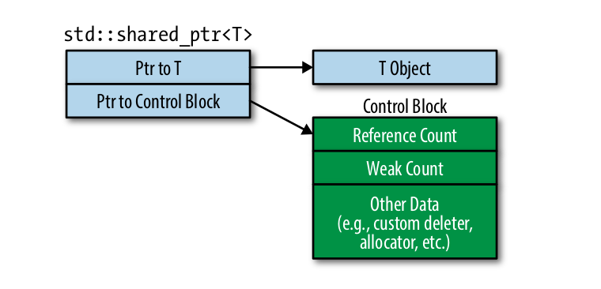
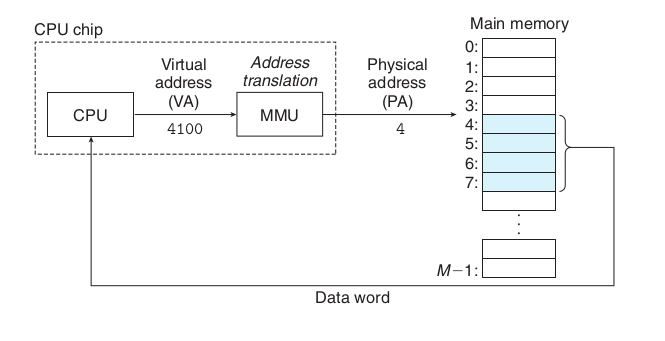

## Topic1: Data Race vs Race condition.

They are very similar, but they have nothing in common.

A data race occurs when:
- two or more threads in a single process access the same memory location concurrently, and
- at least one of the accesses is for writing, and
- the threads are not using any exclusive locks to control their accesses to that memory.

A race condition or race hazard is 
- the condition of an electronics, software, or other system where 
- the system's substantive behavior is dependent on the sequence or timing of other uncontrollable events, 
- leading to unexpected or inconsistent results

They are not the same thing. 
- They are not a subset of one another. 
- They are also neither the necessary, nor the sufficient condition for one another.
- Many race conditions can be caused by data races, but this is not necessary.

The reason why sometime they are easily confused is that both of them can be solved by locking mechanism.

Let's take an example:

```cpp
// No data race, but race condition exists.
// There is no any synchronization mechanism to protect critical region.
bool unsafe_transfer(std::atomic<int>& src, std::atomic<int>& dst, int money) {
  if (money < src) {
    std::this_thread::sleep_for(std::chrono::seconds(1));
    src -= money;
    dst += money;
    return true;
  } else {
    return false;
  }
}

bool safe_transfer(std::atomic<int>& src, std::atomic<int>& dst, std::mutex& mtx, int money) {
  std::scoped_lock lock(mtx);
  if (money < src) {
    std::this_thread::sleep_for(std::chrono::seconds(1));
    src -= money;
    dst += money;
    return true;
  } else {
    return false;
  }
}
```

The code above has no data race, but race condition exists. Atomic can protect a single variable, but it can't protect the critical region.

## Topic2: Thread safety about std::shared_ptr.

Thread safety about std::shared_ptr is important and also confusing. Part of its operation is thread safe, while other's are not.

- Reference count of std::shared_ptr is thread-safe and lock-free.
- Read and write of std::shared_ptr is not thread-safe, because it has 2 data members and operation of read and write is not atomic.

The data structure of shared ptr is as follows:



Consider following operations:
- t0 time：Make shared ptr of p2 and p3. Then, do the following statement: p1 = p2; p2 = p3;
- t1 time：object pointer of p1 **points to** object of p2
- t2 time：object pointer of p2 **points to** object of p3. Meanwhile, control block pointer of p2 points to control block of p3 and p2 is destroyed because its ref count becomes zero. 
- t3 time: control block pointer of p1 points to control block of p2 which do not exist, making p2 a dangling pointer. 


The update operation of std::shared_ptr is not thread-safe, because it consist of 2 steps(update of control block and object.) Becareful, dtor is a write operation.

```c++
struct Foo {};

std::shared_ptr<Foo> foo_ptr;
MutexLock ptr_mtx;

void ReadOp(const std::shared_ptr<Foo>& ptr) {}
void WriteOp(std::shared_ptr<Foo>* ptr) {}

void Read() {
  std::shared_ptr<Foo> local_ptr;
  {
    MutexLockGuard mtx_guard(ptr_mtx);
    local_ptr = foo_ptr; // copy semantics is not heavy
  }
  ReadOp(local_ptr);
}

void Write() {
  std::shared_ptr<Foo> local_ptr;
  {
    MutexLockGuard mtx_guard(ptr_mtx);
    local_ptr = foo_ptr;
  }
  WriteOp(&local_ptr);
}
```

The code above is recommended by chenshuo, which is also a locy copy pattern.

## Topic3: Segmentfaut vs OOM.

I am not ready for this topic, but I want to do some further discussion.



- With virtual addressing, the CPU accesses main memory by generating a virtual address (VA), which is converted to the appropriate physical address before
being sent to main memory.
- The task of converting a virtual address to a physical
one is known as address translation.
- Dedicated hardware on the CPU chip called the memory management unit
(MMU) translates virtual addresses on the fly

 MMU has a very import function：VM as a tool for memory protection.

>Any modern computer system must provide the means for the operating system to control access to the memory system

- A user process should not be allowed to modify its read-only code section.
- Nor should it be allowed to read or modify any of the code and data structures in the kernel.
- It should not be allowed to read or write the private memory of other processes,
- and it should not be allowed to modify any virtual pages that are shared with other processes.

>If an instruction violates these permissions, then the CPU triggers a general
protection fault that transfers control to an exception handler in the kernel, which
sends a SIGSEGV signal to the offending process. Linux shells typically report this
exception as a "segmentation fault."

>If some process inadvertently writes to the memory
used by another process, that process might fail in some bewildering fashion totally
unrelated to the program logic.

For program which is crashed because of OOM, it does not produce a coredump.

>Even if your kernel was configured to generate a core dump, the OOM killer would not cause a core dump to be produced because it sends a SIGKILL. As decribed in signal's man page (7), SIGKILL does not produce a core dump. The only way to change that behavior would therefore require a custom patch to the kernel.

[Why does the memory leak program not crash(killed by oom_killer)?](https://stackoverflow.com/questions/78151043/why-does-the-memory-leak-program-not-crashkilled-by-oom-killer)
