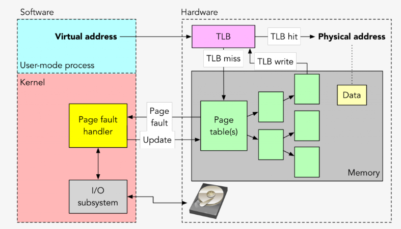
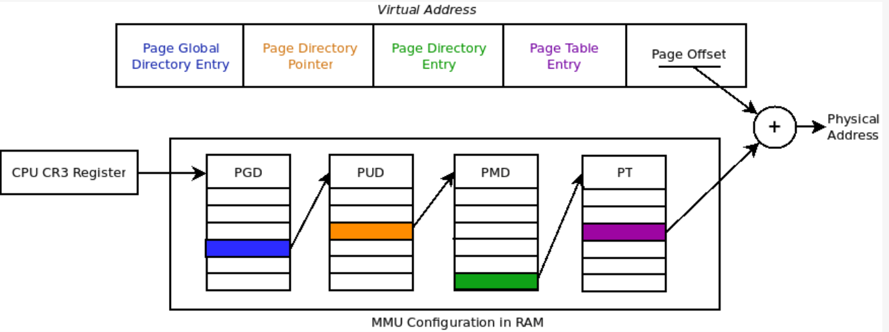
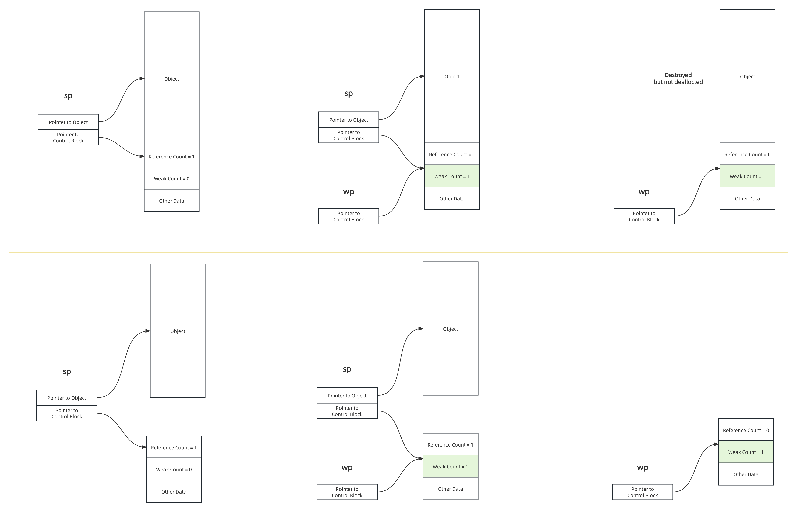

## Topic1: Overcommit memory in Linux.

On modern systems, the dynamic memory allocation uses the principle of overcommit. 

- When this principle is applied (not for each allocation), the memory is not really reserved. 
- The definition of the allocation is simply stored until the first write access into the memory. 
- The writing generates a page access fault, and it is during its handling, that the real mapping is made.

 ### Dynamic allocations in a userspace program.

**The minimum piece of memory managed by the kernel (and by the hardware MMU) is a page**. Nowadays, the page size is generally 4096 bytes. This value is important as it is one threshold used by the libc to ask memory to the kernel.

When using malloc(), three cases are possible :
- Either the libc returns the asked memory without issuing any syscall, for example for small allocation where libc returns usually a fastbin from the fastbin pool.
- Either the libc uses the sbrk() syscall : it increases the process heap size (or decreases it if a negative value is given)
- Either the libc uses the mmap() syscall : a new memory mapping is added to the process (virtually)

Whichever the method, the kernel always tries to provide memory which is not really physically reserved (also called virtually reserved). 

So, for a userspace task, there are :

- **RSS** memory space (resident) : this is the real memory used and dedicated to this program.
- **VSZ** memory space (virtual) : this is the virtual memory which may not have physical space associated yet.
    - For dynamic memory allocation, this is all the page which have not been written yet and 
    - will eventually be converted in resident memory on first write on **page fault** exception.

- There are two kinds of page fault, the minor ones and the major ones. 
- The difference between both is whether an I/O operation (usually a disk access) is required to satisfy the page fault handling or not. A disk access happens when a file is memory-mapped (using mmap()) and then accessed or when a resident page is swapped (backed up on the disk). 

### MMU management overview.

The following image (from Jonathan Anderson, checkout his awesome courses here) shows both hardware and software parts of a page fault handling.



We have seen that a page fault triggers a small piece of code in exception context. **It is this code which adds a new memory mapping**. But to really understand what is done to add a memory mapping, we have to know how it is implemented.

As shown in the previous picture, the two main features of a processor for memory mapping are :

- The ability to walk a page table to find a physical address from a virtual one
- The TLB (Translation Lookaside Buffer) cache

#### The page table

A page table is a data structure stored in RAM. There is one mapping per process in the Linux kernel.

1. The kernel itself has its own page table. If, for each process, we have to map one virtual address with one physical address, the memory mapping itself will fill the whole memory ! 
2. Several mechanisms allows to limit the memory usage (of the mapping) and to takes advantages of HW caches :

- The memory is mapped per page, not per byte. For example, one entry in the page table maps 4096 bytes.
- To take the memory usage low, virtual addresses are splited in 4 or 5 parts, each is an index inside a intermediate table called directory
- A processor register is dedicated to the first level directory. On x86, this is usually CR3.



>01101101 means
> 01 means district
> 10 means school
> 11 means grade
> 01 means class

#### The TLB

In order to speedup the process of translating PGD+PMD+PTE -> physical page, the processor has an additional cache called TLB (Translation lookaside buffer). It only stores the result of the translation process.

#### Minor page fault impact

As you could have guess, **overcommit is here to reduce real memory consumption and to speedup process creation**. But this comes with a downside during runtime : the time taken to access a non-resident memory is a lot longer.

It can be difficult to measure time of faults handling as we need to make sure to use the overcommit principle during an allocation, which strongly depends on libc implementation. Here is a method to do that : we can use posix_memalign()function to allocate million of pages as in the code bellow. This function is recommended to trigger page faults because mmap() is optimized to prevent from triggering lot of page faults (for example by using bigger page or allocating several pages at the same time). The program userfaultfd from kernel source code also uses this function to trigger page faults.

```cpp
unsigned char* mem_alloc_untouched(int size)
{
    unsigned char *buffer;
    int ret;
    ret = posix_memalign((void**)&buffer, size, size);  // same goes for malloc()
    if (!ret || !buffer) {
        perror("memalign");
    }
    return buffer;
}
```

To be able to release memory using free() (which does not have a size argument), libc allocates **more memory** before the address returned by posix_memalign() (same goes for malloc()) in order to store a header where the size is stored (but not only).

As posix_memalign() returns an aligned address, **an additional page** is used before to store the header which becomes resident during allocation because data are written in it (for allocation metadata). This is why, after allocations, we will see page faults (which are not on allocated memory but only for libc chunks header).

```cpp
    /* Initialize our table of pages */
    allocated = malloc(PAGES_USED * sizeof(void*));
    memset(allocated, 0, PAGES_USED * sizeof(void*));
    for (i=0; i<PAGES_USED; i++) {
        allocated[i] = mem_alloc_untouched(page_size);
    }

    /* Here we have reserved a page but no MMU config is done
     * First access of each page will trigger a PF
     * To ensure this is the case, PF are counted and compared to the number of expected PF
     */
    getrusage(RUSAGE_SELF, &usage);
    initial_minpfs = usage.ru_minflt;
    initial_majpfs = usage.ru_majflt;

    /* Trigger PAGES_USED page faults */
    t1 = rt_gettime();
    for (i=0; i<PAGES_USED; i++) {
        touch = allocated[i];
        touch[page_size/2] = 0xff;
    }
    t2 = rt_gettime();
    duration_us = t2 - t1;

    /* Check new numbed of PFs, diff should be PAGES_USED */
    getrusage(RUSAGE_SELF, &usage);
    current_minpfs = usage.ru_minflt;
    current_majpfs = usage.ru_majflt;

    printf("Touching %d pages took %lldus with %d page faults\n",
           PAGES_USED, duration_us, current_minpfs-initial_minpfs);
```

>Using 1048576 pages of 4096 bytes
Touching 1048576 pages took 1682093us with 1048577 pagefaults
Memory locked, no page will be swapped by the kernel unless explicitly released
Touching 1048576 pages took 28260us with 0 pagefaults

- So we can check that each page has trigger a page fault on first write. 
- Then, a second write to these pages does not trigger any page fault as the memory is already resident.

One minor page fault overhead is 1.58us on this platform, which may be insignificant if time constaints are around the millisecond. But, having a big number of page fault may lead to a big overhead.

So for realtime program using a lot of memory, the overhead may be huge and **preventing them is required**.

#### Preventing pagefaults

On realtime systems, **we usually don't care of initiallisation** but we want the runtime to be as fast (also as deterministic) as possible. In order to prevent page fault, we have to make sure three conditions are met :

- **All** memory allocation must be made during initialization
- A page fault is triggered for each allocated page
- No page is given back to the kernel and the kernel does not swap it

The programmer must take care of the first condition during implementation. The two last ones can be managed by mlockall() :

```cpp
mlockall(MCL_CURRENT | MCL_FUTURE)
```

- No allocated page are given back implicity to the kernel after the use of this function. 
- Moreover, if a new allocation is made after that, all new pages trigger a page fault during the allocation and **not when a first write is made**. 
- So, it is very important to allocate memory during initialization when the memory is locked(no page fault occurs) because allocation functions take much longer than if the memory was not locked (as all page faults are made at allocation).

#### Things to know about overcommit

You may think that disabling it is better for realtime systems but beware that you may not have enough memory if you disable it completely.

If overcommit is enabled, the system will trigger a piece of code called "OOM Killer" if the system has no more memory left for userspace allocations.

- Indeed, as malloc() never fail (memory is not really allocated at this time), the OS need a mechanism to handle page faults when the memory is full. 
- When it happens, before allocating a new page, it selects a program based on a score and terminates it. 
- On embedded systems, you should always take care of avoiding OOM Killer as it could terminates an unexepected application.
- However, you can use the sysctl vm.overcommit_ratio to tune the amount of memory usable by userspace applications. 

#### Conclusion

This article presented how Linux application allocates memory and how allocations are managed from the OS point of the view. 

Using overcommit mechanism depends on your needs. 

However, on most embedded system, dealing with commited memory is not necessary as the overhead time is generally low. You should take care of page faults only if you have heavy time constraints or if your application is doing a lot of memory allocations.

## Topic2: Most common memory errors

Any modern computer system must provide the means for the operating system to control access to the memory system

- A user process should not be allowed to modify its read-only code section.
- Nor should it be allowed to read or modify any of the code and data structures in the kernel.
- It should not be allowed to read or write the private memory of other processes,
- and it should not be allowed to modify any virtual pages that are shared with other processes.

>If an instruction violates these permissions, then the CPU triggers a general protection fault that transfers control to an exception handler in the kernel, which sends a SIGSEGV signal to the offending process. Linux shells typically report this exception as a "segmentation fault."

>If some process inadvertently writes to the memory used by another process, that process might fail in some bewildering fashion totally unrelated to the program logic.

The most common problems are(in a docker env):
- Illegal memory assess.
    - deference illegal pointer.
        - dangling pointer or wild pointer(addr doesn't belong to current process).
    - deference nullptr.
    - subscript overflow.
    - double free.
    - buffer overrun.(It's also depended on implementation.)
- OOM.
    - Memory leak.
    - Memory is not enough.
        - Wrong estimate about memory usage.(Config is not right.)
        - Unexpected memory consumption.
            - dead loop/dead lock, the program can not continue. But, there are new req comming in.

## Topic3: Initialization of std::shared_ptr.

std::make_shared may be used as an alternative to std::shared_ptr<T>(new T(args...)). The trade-offs are:
- ```std::shared_ptr<T>(new T(args...))``` performs at least two allocations (one for the object T and one for the control block of the shared pointer), while std::make_shared<T> typically performs only one allocation (the standard recommends, but does not require this; all known implementations do this).
- If any std::weak_ptr references the control block created by std::make_shared after the lifetime of all shared owners ended, the memory occupied by T persists until all weak owners get destroyed as well, which may be undesirable if sizeof(T) is large.
- Unlike the ```std::shared_ptr``` constructors, std::make_shared does not allow a custom deleter.
- ```std::shared_ptr``` supports array types (as of C++17), but ```std::make_shared``` does not. This functionality is supported by ```boost::make_shared```.
- code such as ```f(std::shared_ptr<int>(new int(42)), g())``` can cause a memory leak if g gets called after new int(42) and throws an exception, while f(std::make_shared<int>(42), g()) is safe, since two function calls are never interleaved.
- ```std::shared_ptr<T>(new T(args...))``` may call a non-public constructor of T if executed in context where it is accessible, while std::make_shared requires public access to the selected constructor.
- ```std::make_shared``` uses ```::new```, so if any special behavior has been set up using a class-specific operator new, it will differ from std::shared_ptr<T>(new T(args...)).

Let's take a closer look at the object lifetime issues that arise because of difference way of initialization of smart pointer. 



```cpp 
class ReallyBigType {};
std::weak_ptr<ReallyBigType> wptr;

void process(std::weak_ptr<ReallyBigType>) {
}

void test_shared_ptr_with_make_shared() {
  // some logic.
  // ......
  {
    auto sptr = std::make_shared<ReallyBigType>();

    wptr = sptr;
    auto another_sptr = wptr.lock();
    if (another_sptr) {
      // do something with another_sptr
    }
  }
  // Here, the ReallyBigType is destroyed but the memory formerly occupied
  // by large object remains allocated.
}

void test_shared_ptr_with_shared_ctor() {
  // some logic.
  // ......
  {
    std::shared_ptr<ReallyBigType> sptr(new ReallyBigType);

    wptr = sptr;
    auto another_sptr = wptr.lock();
    if (another_sptr) {
      // do something with another_sptr
    }
  }
  // Here, the ReallyBigType is destroyed and the memory occupied is released.
  // But, control block remains allocated.
}
```

## Ref

[overcommit-memory-in-linux](https://www.linuxembedded.fr/2020/01/overcommit-memory-in-linux)<br>
[std::make_shared, std::make_shared_for_overwrite](https://en.cppreference.com/w/cpp/memory/shared_ptr/make_shared)
