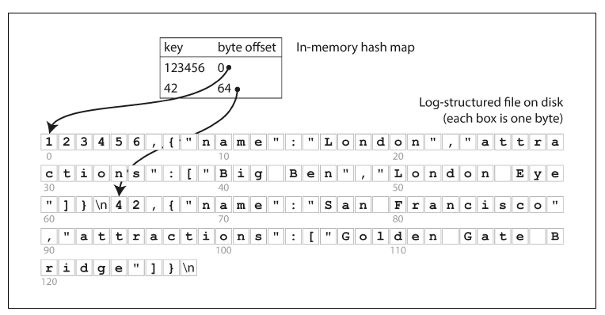
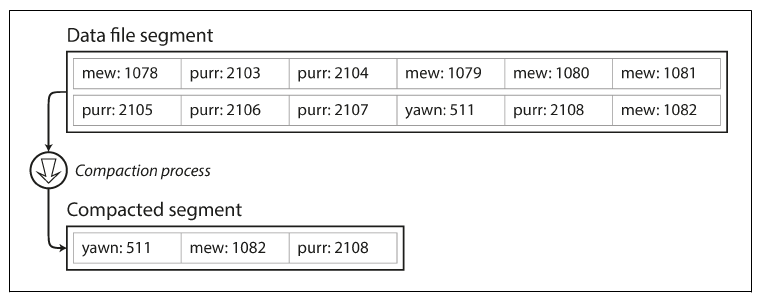
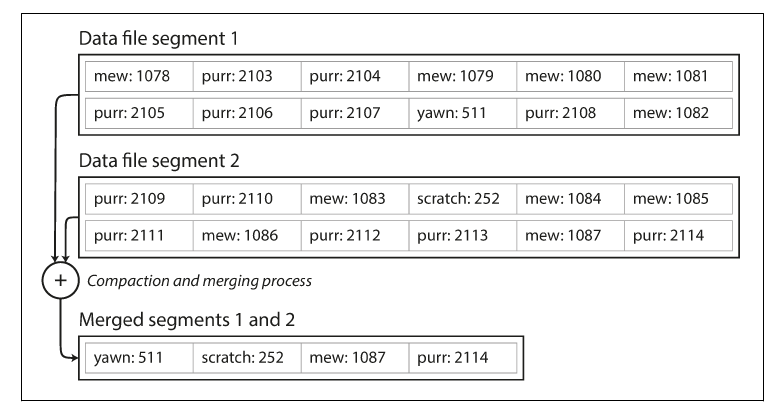

## Intro

In this chapter we discuss the same from the database’s point of view: how we can store the data that we’re given, and how we can find it again when we’re asked for it.

Consider the world’s simplest database, implemented as two Bash functions:

```bash
#!/bin/bash
db_set () {
  echo "$1,$2" >> database
}

db_get () {
  grep "^$1," database | sed -e "s/^$1,//" | tail -n 1
}
```

And it works:

```bash
$ db_set 123456 '{"name":"London","attractions":["Big Ben","London Eye"]}'
$ db_set 42 '{"name":"San Francisco","attractions":["Golden Gate Bridge"]}'

$ db_get 42
{"name":"San Francisco","attractions":["Golden Gate Bridge"]}
```

Our db_set function actually has pretty good performance for something that is so
simple, because **appending to a file is generally very efficient.**


Similarly to what ```db_set``` does, many databases internally use a log, which is an append-only data file.

>The word log is often used to refer to application logs, where an
application outputs text that describes what’s happening. In this
book, log is used in the more general sense: an append-only
sequence of records. It doesn’t have to be human-readable; it might
be binary and intended only for other programs to read.

**When we talk about log-structured file, it actually means an append-only sequence of records.**

On the other hand, our ```db_get``` function has terrible performance if you have a large
number of records in your database.

In order to efficiently find the value for a particular key in the database, we need a
different data structure: an index.

An index is an additional structure that is derived from the primary data.
- Many databases allow you to add and remove indexes, and this doesn’t affect the contents of the
database.
- it only affects the performance of queries
- Maintaining additional structures incurs overhead, especially on writes. 
    - For writes, it’s hard to beat the performance of simply appending to a file, because that’s the simplest possible write operation. 
    - Any kind of index usually slows down writes, because the index also needs to be updated every time data is written.

**This is an important trade-off in storage systems: well-chosen indexes speed up read queries, but every index slows down writes.** 

## Hash Indexes

- Let’s say our data storage consists only of appending to a file.(log-structure file on disk)
- Then the simplest possible indexing strategy is this: keep an in-memory hash map where every key is mapped to a byte offset in the data file.

When you want to look up a value, use the hash map to find the offset in the
data file, seek to that location, and read the value.



A storage engine like Bitcask is well suited to situations where the value for each key is updated frequently.
- In this kind of workload, there are a lot of writes, but there are not too many distinct keys—you have a large number of writes per key, but it’s feasible to keep all keys in memory.
- As described so far, we only ever append to a file—so how do we avoid eventually running out of disk space?

A good solution is to 
- break the log into segments of a certain size by closing a segment file when it reaches a certain size, and making subsequent writes to a new segment file.
- We can then perform compaction on these segments
  - Compaction means throwing away duplicate keys in the log, 
  - and keeping only the most recent update for each key.



Moreover, since compaction often makes segments much smaller (assuming that a key is overwritten several times on average within one segment), we can also merge several segments together at the same time as performing the compaction.
- Segments are never modified after they have been written, so the merged segment is written to a new file.
- The merging and compaction of frozen segments can be done in a background thread.
- After the merging process is complete,
  - we switch read requests to using the new merged segment instead of the old segment
  - and then the old segment files can simply be deleted.

